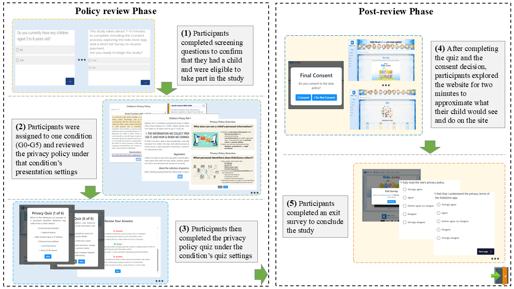

<h1 align="center"> Consent without Comprehension: A Randomized Experiment on Pedagogical Friction 
  
  in Privacy Policy Flows</h1>

  

## 🔍 Overview

Privacy policies govern how personal data is collected, used, and shared. Yet, in most privacy-policy consent flows, agreement is operationalized as a single click at the end of a long, opaque policy document. Recent privacy-law scholarship has argued for a standard of demonstrably informed consent. That is, the party drafting and designing privacy-policy consent mechanisms must generate reliable evidence that a person demonstrates comprehension of the consequential terms to which they agree. To this end, we study pedagogical friction as a design framing: minimal interventions embedded within a privacy-policy consent flow that aim to support demonstrated comprehension while keeping burden on the user low. 

In a randomized experiment, we tested pedagogical friction for demonstrably informed consent in the context of a privacy policy for an edtech app for young children. We recruited 293 parents of kids ages 3-8 to review the app’s privacy policy under one of six conditions that varied presentation format and pacing, then complete a six-question comprehension quiz. Three conditions offered a second policy review and quiz retake for participants who did not pass this quiz on their first attempt. We find that the slide-based condition (G3) achieved the highest first-attempt threshold attainment (≥80%) (41.7%), followed by the paced, sectioned condition (G4) (30.6%). In the retake conditions, 64.9% of participants who completed a second attempt improved their score. Notably, in conditions that did not gate consent on demonstrated comprehension, 97.3% of participants who scored below the threshold still chose to consent, suggesting that ungated consent flows can record agreement without demonstrated comprehension. Our results suggest that pedagogical friction can strengthen the evidentiary basis of consent and clarify what it costs in time and burden.

The scripts listed below reproduce the analyses reported in the paper.

---

## 🚀 Analysis scripts

### 1. RQ1: Can added friction during privacy policy review improve demonstrated comprehension of key terms prior to consent?

**Quiz performance by condition**

- `quiz_performance.py`  
  - First attempt accuracy.
  - First attempt threshold attainment.
- `quiz_difficulty.py`  
  - The hardest and easiest questions.
  - The hardest to correct questions.

**Retake outcomes for conditions with a second attempt**

- `compute_retry_answer.py`  
  - Second attempt accuracy.
  - Second attempt threshold attainment.
  - Retake gains
  - Error correction analysis

---

### 2. RQ2: What costs accompany frictional interventions and how are they tolerated by users?

**Time cost**

- `compute_time_spend.py`  
  - Analyze first-attempt quiz completion time.
  - Second-attempt quiz completion time.
  - Analyze first-attempt policy review time.
  - Second-attempt policy review time.

**User tolerance of friction**

- `survey_accuracy.py`  
  - Analyze how participants tolerated the interventions.

---

### 3. Consent Decisions

**Consent rate**

- `consent_analysis.py`  
  - Consent among participants who met the threshold.
  - Consent among participants unmet the threshold.

---

## 📊 Usage and data

### 1. Each script contains:
- Expected input data files.
- Any preprocessing steps required before running the analysis.

### 2. To replicate results, please:
1. Place the analysis dataset in the paths expected by the scripts.
2. Run the relevant script(s) with your preferred Python environment.

   

